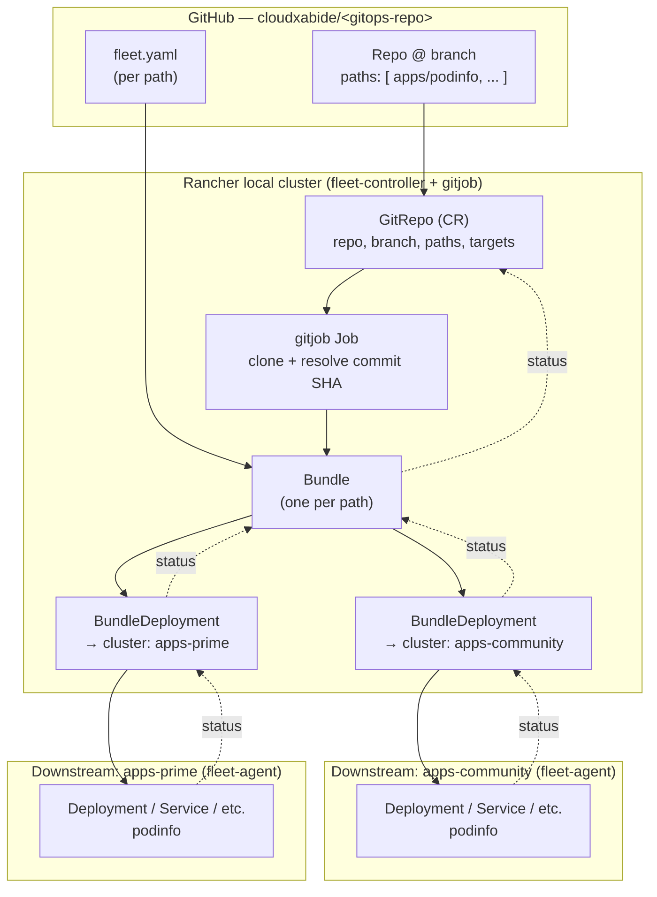

# GitOps with Fleet — Deep Dive (Overview)

> [!NOTE]
> This is a **concept and architecture** deep dive. A separate hands-on walkthrough will be built later from the podinfo example threaded through this document.
> Fleet is the GitOps engine bundled with Rancher Manager — it is *one* way to do GitOps here, not *the* way. Argo CD and Flux are equally valid and are contrasted near the end.

This document explains what Fleet is, how it fits into a Rancher-managed homelab, the objects it creates, how a Git repository becomes running workloads on one or more clusters, and the operational details worth knowing before you commit to it.

---

## TL;DR — What Fleet actually does

1. You commit Kubernetes manifests, Helm charts/values, or Kustomize overlays to a **Git repository** (for this lab: GitHub, under the `cloudxabide` org).
2. You create a `GitRepo` **custom resource** in the Rancher **local cluster** (via the Rancher UI → *Continuous Delivery*, or `kubectl apply`). It points at a repo, a branch, and one or more **paths**.
3. Fleet scans each path, turns it into a **Bundle**, and — for every downstream cluster that matches the target rules — creates a **BundleDeployment**.
4. A **fleet-agent** running on each downstream cluster pulls its BundleDeployment and applies the resources.
5. Fleet continuously re-checks Git (poll or webhook) and the live state, reporting drift and (optionally) correcting it.

The unit of configuration you write is a **`fleet.yaml`** file that lives in the repo alongside your manifests. The unit Fleet reconciles is a **Bundle**.

---

## Narrative — Why Fleet in this environment

In a Rancher homelab you already have Fleet. It is installed on the Rancher **local** (management) cluster by default and every cluster Rancher imports or provisions is automatically registered with Fleet. There is no extra controller to stand up, no second control plane to secure, and multi-cluster targeting is native rather than bolted on.

The alternative — logging into each cluster and running `helm upgrade` / `kubectl apply` by hand — does not scale past one cluster and leaves no audit trail. GitOps inverts that: Git is the source of truth, changes are pull requests, and the cluster state is a *consequence* of a commit rather than of whoever last ran a command. Fleet is the piece that watches Git and makes the cluster match.

Fleet's model is **pull-ish**: the `fleet-controller` on the local cluster does the Git scanning and bundle creation centrally, but the `fleet-agent` on each downstream cluster is what actually applies resources and reports status back. Downstream clusters never need inbound access from the management cluster for app delivery — the agent reaches *out* to the Fleet API on the local cluster.

---

## Architecture & object model

### Components

| Component | Runs on | Responsibility |
|:----------|:--------|:---------------|
| `fleet-controller` | Rancher local cluster | Watches `GitRepo`/`Bundle`, computes targets, creates `BundleDeployment`s, aggregates status |
| `gitjob` controller | Rancher local cluster | Spawns a Job per `GitRepo` to clone the repo and detect the latest commit for the tracked branch/revision |
| `fleet-agent` | Every managed cluster (including local) | Watches its own `BundleDeployment`s, renders and applies resources, reports live/ready state |

### Namespaces & workspaces

- **`fleet-local`** — the workspace/namespace representing the Rancher local cluster itself. `GitRepo`s created here deploy *to* the management cluster.
- **`fleet-default`** — the default workspace holding every downstream cluster Rancher manages. Most application `GitRepo`s live here.
- **Custom workspaces** — you can create additional Fleet workspaces to group clusters and delegate RBAC (e.g. a per-team or per-environment workspace).

### The object chain



- **`GitRepo`** — you author this. Repo URL, branch/revision, list of `paths`, optional `targets`, poll interval, credentials secret.
- **`Bundle`** — Fleet generates one per path (a `fleet.yaml` can also split a path into multiple bundles). This is the reconciliation unit and carries the rendered/packaged content plus per-target customizations.
- **`BundleDeployment`** — Fleet generates one per (Bundle × matched cluster). This is what a given `fleet-agent` watches. Its status rolls back up to the Bundle and then to the `GitRepo`, which is what you see in the Rancher UI.
- **`Cluster` / `ClusterGroup`** — Fleet's representation of managed clusters and label-based groupings of them, used as targeting selectors.

### CRD reference

| CRD | Group | Authored by | Purpose |
|:----|:------|:------------|:--------|
| `GitRepo` | `fleet.cattle.io` | You | Bind a Git repo/branch/paths to a set of target clusters |
| `Bundle` | `fleet.cattle.io` | Fleet | Packaged, deployable content unit derived from a path + `fleet.yaml` |
| `BundleDeployment` | `fleet.cattle.io` | Fleet | Per-cluster instance of a Bundle; watched by that cluster's agent |
| `Cluster` | `fleet.cattle.io` | Rancher/Fleet | A managed cluster registered with Fleet |
| `ClusterGroup` | `fleet.cattle.io` | You (optional) | Label selector grouping clusters for targeting |
| `ClusterRegistrationToken` | `fleet.cattle.io` | Fleet | Bootstrap credential an agent uses to register |
| `GitRepoRestriction` | `fleet.cattle.io` | Admin (optional) | Constrain which repos/branches/SAs are allowed in a workspace |

---

## How a `GitRepo` is processed

- **Change detection** — by default Fleet polls the repo every **15s–15m** (`spec.pollingInterval`, default 15s in newer releases but often tuned up). For faster, quieter reconciliation configure a **webhook** from GitHub to the Fleet gitjob endpoint; polling then becomes a fallback.
- **`paths`** — each entry is scanned independently. A path with no `fleet.yaml` is treated as raw YAML with defaults. `paths: []` means "scan the repo root."
- **`branch` vs `revision`** — track a moving branch for environments that should always follow `main`, or pin a `revision` (tag/SHA) for change-controlled environments.
- **Credentials** — for a **public** GitHub repo (this lab's default) none are needed. For private repos, reference a `Secret`:
  - HTTPS: `kubernetes.io/basic-auth` secret with a GitHub PAT.
  - SSH: `kubernetes.io/ssh-auth` secret with a deploy key; supply `known_hosts` to avoid host-key prompts.
  - Custom CA: `spec.caBundleSecretName` when the Git host uses a private CA (relevant for a self-hosted Git server in an enclave).

---

## `fleet.yaml` — the file you actually write

`fleet.yaml` sits in the repo at (or below) a scanned path and tells Fleet how to package and where to place that path's content. Key stanzas:

| Field | What it controls |
|:------|:-----------------|
| `defaultNamespace` | Namespace resources land in when they don't specify one |
| `namespace` | Force *all* resources into this namespace |
| `helm.chart` / `helm.repo` / `helm.version` | Deploy an external chart instead of vendored manifests |
| `helm.values` / `helm.valuesFiles` | Inline values / value files (relative to the path) |
| `kustomize.dir` | Render via Kustomize instead of Helm/raw |
| `diff.comparePatches` | Ignore known-noisy fields (e.g. fields a mutating webhook injects) so they don't show as drift |
| `dependsOn` | Gate this bundle on another bundle being Ready (ordering) |
| `targetCustomizations` | Per-cluster/-group overrides of any of the above |
| `helm.takeOwnership` | Adopt resources not previously managed by this release |

### Reference example — podinfo via Helm

Repo layout (in `cloudxabide/<gitops-repo>`):

```
apps/
└── podinfo/
    ├── fleet.yaml
    └── values-prime.yaml
```

`apps/podinfo/fleet.yaml`:

```yaml
defaultNamespace: podinfo

helm:
  releaseName: podinfo
  repo: https://stefanprodan.github.io/podinfo
  chart: podinfo
  version: 6.7.1
  values:
    replicaCount: 2
    ui:
      message: "Deployed by Fleet — homelab"

# One repo, one bundle, per-environment overrides.
targetCustomizations:
  - name: community
    clusterSelector:
      matchLabels:
        env: community
    helm:
      values:
        replicaCount: 1

  - name: prime
    clusterSelector:
      matchLabels:
        env: prime
    helm:
      valuesFiles:
        - values-prime.yaml
```

`GitRepo` custom resource (created in `fleet-default`, e.g. via the Rancher UI or `kubectl`):

```yaml
apiVersion: fleet.cattle.io/v1alpha1
kind: GitRepo
metadata:
  name: homelab-apps
  namespace: fleet-default
spec:
  repo: https://github.com/cloudxabide/<gitops-repo>
  branch: main
  paths:
    - apps/podinfo
  # No targets: → defaults to every cluster in this workspace.
  # Narrow with a selector once more apps exist:
  # targets:
  #   - clusterSelector:
  #       matchLabels:
  #         env: prime
```

What you should then see (names abbreviated):

```
$ kubectl -n fleet-default get gitrepo homelab-apps
NAME           REPO                                             COMMIT    BUNDLEDEPLOYMENTS-READY   STATUS
homelab-apps   https://github.com/cloudxabide/<gitops-repo>     a1b2c3d   2/2

$ kubectl -n fleet-default get bundle
NAME                        BUNDLEDEPLOYMENTS-READY   STATUS
homelab-apps-apps-podinfo   2/2

$ kubectl -n fleet-default get bundledeployment -A
NAMESPACE                       NAME                        DEPLOYED   MONITORED   STATUS
cluster-fleet-default-...-a1    homelab-apps-apps-podinfo   True       True
cluster-fleet-default-...-b2    homelab-apps-apps-podinfo   True       True
```

---

## Targeting clusters

Fleet decides which clusters a Bundle goes to by combining:

1. **Workspace** — the Bundle only ever considers clusters in the same Fleet workspace as its `GitRepo`.
2. **`GitRepo.spec.targets`** — a list of `clusterSelector` / `clusterGroupSelector` / `clusterName` entries. Empty = all clusters in the workspace.
3. **`fleet.yaml` `targetCustomizations`** — does *not* add or remove targets; it selects which override block applies to each already-matched cluster.

Selectors match on **cluster labels**. In the Rancher UI: *Cluster Management → <cluster> → Edit Config → Labels*, or `kubectl -n fleet-default label cluster <name> env=prime`.

### Mapping to `ENVIRONMENT={community|prime|enclave}` (brief)

The lab's three deployment modes map cleanly onto Fleet targeting:

- Label each downstream apps cluster `env: community`, `env: prime`, or `env: enclave`.
- Keep **one** GitOps repo. Each app's `fleet.yaml` uses `targetCustomizations` keyed on that label to vary only what differs per mode — typically the **image registry** (public vs SUSE Prime registry vs Harbor mirror), chart version, and replica/resource sizing.
- The `enclave` customization is where air-gap concerns concentrate: chart pulled from a mirrored Helm repo, images rewritten to the internal registry, `caBundleSecretName` on the `GitRepo` if Git is self-hosted. See [`Airgap_Overview.md`](./Airgap_Overview.md).

This document does not build the three-environment repo out; that belongs in the hands-on walkthrough.

---

## Repo layout guidance

For this lab, start with a **single GitOps monorepo** under `cloudxabide`:

```
<gitops-repo>/
├── apps/                 # one dir per workload, each with a fleet.yaml
│   ├── podinfo/
│   └── <next-app>/
├── infra/                # cluster-wide add-ons (cert-manager, ingress, monitoring agents)
│   └── <component>/
└── clusters/             # optional: per-cluster bootstrap bundles
```

- One `GitRepo` per top-level directory (`apps`, `infra`) keeps status legible and blast radius small.
- Move to repo-per-team only when RBAC boundaries or PR ownership actually demand it.
- Reference: [`rancher/fleet-examples`](https://github.com/rancher/fleet-examples) covers raw, Helm, Kustomize, and multi-cluster patterns.

---

## Rancher UI integration

- **Continuous Delivery** (left nav, in the cluster explorer for the local cluster) is the Fleet front end: Git Repos, Clusters, Cluster Groups, and Bundles, scoped by **workspace** (top selector).
- Creating a `GitRepo` here is the same as `kubectl apply` — the form just writes the CR.
- **Status drill-down**: `GitRepo` → per-cluster rollup → Bundle → resource list with live state and diffs. This is the fastest way to see *why* something is `NotReady`.
- **RBAC**: access is per workspace. `GitRepoRestriction` in a workspace can constrain allowed repos, branches, and service accounts so a delegated team can only deploy from sanctioned sources.

---

## Drift correction & self-healing

- Fleet always **reports** drift: a resource changed out-of-band shows as `Modified` on the Bundle with a diff.
- Set `correctDrift.enabled: true` (in `fleet.yaml`) to have the agent **revert** out-of-band changes on the next reconcile.
- Use `diff.comparePatches` to whitelist fields that legitimately change after apply (defaulting webhooks, HPA-managed replicas, autoscaler annotations) so they don't produce permanent false drift.
- Failure to apply shows as `ErrApplied` with the API server error attached.

---

## Secrets

Fleet is **not** a secrets manager. It will happily sync a `Secret` manifest from Git, which means plaintext secrets in Git — don't. Options, in rough order of preference for this lab:

- **External Secrets Operator** — Git holds an `ExternalSecret` reference; the real value comes from a vault/secret store at runtime.
- **SOPS** (with a Fleet/Kustomize decrypt step or a controller) — encrypted values committed to Git.
- **Sealed Secrets** — cluster-specific encrypted `SealedSecret` in Git, decrypted by an in-cluster controller.

Pick one before putting any real workload secret through GitOps.

---

## Air-gap / enclave note

Full treatment is in [`Airgap_Overview.md`](./Airgap_Overview.md). Fleet-specific points:

- The Git host must be reachable from the Rancher local cluster (self-hosted Gitea/GitLab in the enclave, not GitHub).
- Helm charts referenced by `helm.repo` must be mirrored (Harbor OCI or a mirrored chart repo); update `helm.repo`/`helm.chart` accordingly, per-env via `targetCustomizations`.
- Container images referenced by charts must be rewritten to the internal registry — via chart values (`global.imageRegistry` style) in the `enclave` customization.
- Set `GitRepo.spec.caBundleSecretName` for a privately-signed Git endpoint.
- The `fleet-agent` image itself must be present in the internal registry (handled by the Rancher air-gap install).

---

## Fleet vs Argo CD vs Flux

| Dimension | Fleet | Argo CD | Flux |
|:----------|:------|:--------|:-----|
| Ships with | Rancher (installed, integrated) | Standalone install | Standalone install |
| Multi-cluster | Native — central controller, per-cluster agents | Hub model or Applicationsets; agent add-ons | Per-cluster install + hub patterns |
| Primary UX | Rancher UI (Continuous Delivery) + CRDs | Rich dedicated web UI | CLI + CRDs (UI via third parties) |
| Packaging | Raw / Helm / Kustomize via `fleet.yaml` | Raw / Helm / Kustomize / plugins | Raw / Helm / Kustomize via controllers |
| Per-target overrides | `targetCustomizations` (first-class) | ApplicationSet generators / Helm params | Kustomize overlays / `HelmRelease` values |
| Scale story | Designed for many (100s–1000s) small clusters | Strong for many apps on fewer clusters | Strong GitOps primitives, composable |
| Best fit here | You already run Rancher and want multi-cluster GitOps with zero extra infra | You want a best-in-class app dashboard and sync UX | You want modular, controller-per-concern GitOps |

For this homelab, Fleet is the default *because* Rancher is the platform. Argo CD is worth adding later if the visual sync/rollback UX becomes a priority.

---

## Gotchas & troubleshooting

| Symptom | Likely cause | Where to look |
|:--------|:-------------|:--------------|
| `GitRepo` shows no commit / no bundles | `paths` wrong, or `fleet.yaml` not under a scanned path | gitjob Job logs: `kubectl -n fleet-default logs job/<gitrepo>-<hash>` |
| Bundle `NotReady`, 0 BundleDeployments | No cluster matches the target selector / wrong label or workspace | `kubectl -n fleet-default get clusters.fleet.cattle.io --show-labels` |
| Helm values ignored | `values` under the wrong key, or overridden by a `targetCustomizations` block that also matched | Rendered Bundle: `kubectl -n fleet-default get bundle <name> -o yaml` |
| Bundle rejected — too large | Vendored chart/manifests exceed the ~1MB bundle limit | Switch to `helm.chart` + `helm.repo` (pull at deploy time) instead of committing the chart |
| Resource shows permanent `Modified` | A controller mutates the resource post-apply | Add `diff.comparePatches` to ignore those fields |
| Downstream never deploys | `fleet-agent` not registered / not running | On the downstream cluster: `kubectl -n cattle-fleet-system get pods` |
| Slow to pick up commits | Polling interval high and no webhook | Lower `pollingInterval` or configure a GitHub webhook |

Useful commands:

```
# All Fleet objects for a repo, local cluster
kubectl -n fleet-default get gitrepo,bundle,bundledeployment

# Why is this bundle unhappy?
kubectl -n fleet-default describe bundle <name>

# gitjob (clone/commit-detection) logs
kubectl -n fleet-default logs -l fleet.cattle.io/gitrepo=<name> --tail=200

# Agent side, on a downstream cluster
kubectl -n cattle-fleet-system logs deploy/fleet-agent
```

---

## Illustrative walkthrough (podinfo) — seed for the hands-on doc

This is the concept end-to-end; the full lab (cluster labels, GitHub repo creation, webhook, verification) will be its own document.

1. **Repo** — create `cloudxabide/<gitops-repo>` on GitHub, public, with `apps/podinfo/fleet.yaml` as shown above.
2. **Labels** — label the target downstream cluster(s): `kubectl -n fleet-default label cluster <name> env=prime`.
3. **Register** — apply the `GitRepo` CR into `fleet-default` (or create it in Rancher → Continuous Delivery).
4. **Observe** — `GitRepo` picks up the commit → one `Bundle` (`homelab-apps-apps-podinfo`) → one `BundleDeployment` per matched cluster → `podinfo` Deployment/Service appear in the `podinfo` namespace on each.
5. **Change** — bump `helm.values.ui.message`, commit, and watch the Deployment roll on every targeted cluster with no further action.
6. **Drift** — `kubectl scale deploy/podinfo --replicas=5` on a downstream cluster; Fleet reports `Modified`, and with `correctDrift.enabled` reverts it.

---

## References

- [Fleet documentation](https://fleet.rancher.io/)
- [Rancher — Continuous Delivery (Fleet) in the UI](https://ranchermanager.docs.rancher.com/integrations-in-rancher/fleet)
- [`fleet.yaml` reference](https://fleet.rancher.io/ref-fleet-yaml)
- [Fleet — Git repository targeting](https://fleet.rancher.io/gitrepo-targets)
- [`rancher/fleet-examples`](https://github.com/rancher/fleet-examples)
- [podinfo chart](https://github.com/stefanprodan/podinfo)
- [OpenGitOps — principles](https://opengitops.dev/)
- [Argo CD](https://argo-cd.readthedocs.io/) · [Flux](https://fluxcd.io/)
- Related in this repo: [`Airgap_Overview.md`](./Airgap_Overview.md)
