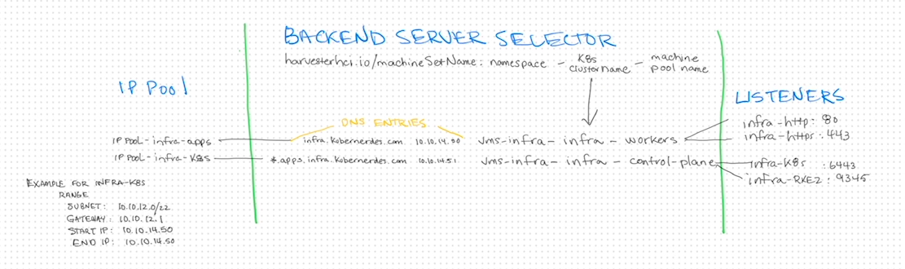

# Harvester Load Balancer

> [!NOTE] 
> This is simply *one* way of doing this, not *the* way of doing this.

I **started** this doc with the note as I feel it is the most important thing to consider.  The approach you take in your environment likely will depend on a number of factors, and ultimately relies on your "style" or approach and standards.  Flexibility here feels like a strength and detriment at the same time.

## Narrative
My "Infra Cluster" has 2 functions: firstly, it is a Kubernetes cluster (obviously) - secondly, it is an application environment.  I will have 2 machine pools: control-plane, and workers.  The control-plane needs access via ports 6443 (K8s API) and 9345 (RKE2 Services), the workers need port 80 and 443.  (i.e. I don't want to send K8s API traffic to the worker nodes and conversely I don't want to send application traffic to the control-plane nodes.  You may want to have different machine-pools based on workload type (heavy CPU vs high Memory, or GPU nodes, etc...) and in that case you would likely redirect traffic based on that.

Also - regarding the "Backend Server Selector": this is an area that will be highly dependent on how you create your systems and what standards you utilize.  The selector can use existing Harvester or Rancher labels, or you can create your own.

For VMs deplyed using Harvester (i.e. my Rancher Manager VMs) I will use:

For VMs deploy using Rancher Manager that only have a single machine pool, I will use:
guestcluster.harvesterhci.io/name: vms-observability

For VMs deployed using Rancher Manager with multiple machine pool, I will use:  
harvesterhci.io/machineSetName	vms-apps-apps-workers  
harvesterhci.io/machineSetName	vms-apps-apps-control-plane  

I will have the following DNS entries:  
infra.kubernerdes.com         IN A 10.10.14.50   # K8s endpoint  
*.apps.infra.kubernerdes.com  IN A 10.10.14.51   # Applications endpoint

## Technical Details

ClusterName: infra
Machine Pools: 
- Pool Name: control-plane, workers

Create DNS records for 
- Kubernetes (K8s) endpoint  
- Application endpoint

IPPool(s)
- infra-k8s
- infra-apps

LoadBalancer(s)
- lb-infra-k8s
- lb-infra-apps

Listeners
- infra-k8s: 6443
- infra-rke2: 9345
- infra-http: 80
- infra-https: 443

| Endpoint                     | IP Addr (range) | IPPool            | Port | Listener Name | Load Balancer Name | Machine Pool Name             | 
|:-----------------------------|:----------------|:------------------|:-----|:--------------|:-------------------|:------------------------------|
| infra.kubernerdes.com        | 10.10.14.50     | ippool-infra-k8s  | 6443 | infra-k8s     | lb-infra-k8s       | vms-infra-infra-control-plane |
| infra.kubernerdes.com        | 10.10.14.50     | ippool-infra-k8s  | 9345 | infra-rke2    | lb-infra-k8s       | vms-infra-infra-control-plane |
| *.apps.infra.kubernerdes.com | 10.10.14.51     | ippool-infra-apps | 80   | infra-http    | lb-infra-apps      | vms-infra-infra-workers       |
| *.apps.infra.kubernerdes.com | 10.10.14.51     | ippool-infra-apps | 443  | infra-https   | lb-infra-apps      | vms-infra-infra-workers       |



## 
> [!NOTE] 
> The following was retrieved using MerlinAI (which I believe used Sonnet for this query)

In Harvester, the Load Balancer's **backend server selector** utilizes standard label selectors consisting of **Key** and **Value** pairs to dynamically identify which Virtual Machines (VMs) should receive incoming network traffic. Rather than hardcoding IP addresses, you assign specific labels to your VMs, and the load balancer automatically targets any VM that matches those exact label configurations. Because Harvester is built on top of Kubernetes, the most commonly used values typically follow standard Kubernetes labeling conventions. 

Administrators generally define these selectors based on the application's architecture, environment, or specific role within the cluster. Because the actual values are user-defined, there is no single "correct" value, but standardizing your naming conventions is a highly recommended best practice for maintainability. 

Here is a table outlining the most commonly used keys and values for backend server selectors:

| Selector Key | Common Values | Purpose |
| :--- | :--- | :--- |
| `app` | `nginx`, `apache`, `grafana` | Identifies the specific application or software stack running on the target VMs. |
| `role` | `backend`, `frontend`, `api` | Defines the specific function of the VM within a distributed system or microservices architecture. |
| `env` or `environment` | `production`, `staging`, `dev` | Ensures the load balancer only routes traffic to VMs within a specific deployment environment. |
| `tier` | `web`, `application`, `db` | Indicates the architectural tier of the server, often used in multi-tier application setups. |

When configuring this in the Harvester UI, you will navigate to the **Backend Server Selector** tab during the Load Balancer creation process. You simply input the exact Key and Value pairs you want to target. If you later deploy a new VM and apply those same matching labels, the Harvester load balancer will automatically detect the new instance and begin routing traffic to it, enabling seamless horizontal scaling. Conversely, if a VM loses that label or goes down, it is removed from the load balancer's target pool.

Ultimately, the most effective backend server selector values are the ones that perfectly align with your organization's internal infrastructure tagging strategy. Using simple, descriptive, and consistent key-value pairs ensures that your network routing remains predictable as your Harvester cluster grows. 

## References
[SUSE Harvester | Load Balancer](https://docs.harvesterhci.io/v1.8/networking/loadbalancer/)   
[Harvester GitHub Repository](https://github.com/harvester/harvester)  
[Baytech Consulting Architectural Overview](https://www.baytechconsulting.com/blog/harvesters-disruption-of-the-hci-space)  
[How to Configure Harvester Load Balancer](https://oneuptime.com/blog/post/2026-03-20-harvester-load-balancer/view)

## Example Commands
```
mansible@nuc-00 [homelab] ~> kubectl get crd loadbalancers.loadbalancer.harvesterhci.io
NAME                                         CREATED AT
loadbalancers.loadbalancer.harvesterhci.io   2026-07-19T13:23:33Z
mansible@nuc-00 [homelab] ~> kubectl get crd ippools.loadbalancer.harvesterhci.io
NAME                                   CREATED AT
ippools.loadbalancer.harvesterhci.io   2026-07-19T13:23:33Z

mansible@nuc-00 [homelab] ~> kubectl get loadbalancer -A
NAMESPACE           NAME               DESCRIPTION   WORKLOADTYPE   IPAM   ADDRESS       AGE
vms-apps            lb-apps-apps                     vm             pool   10.10.14.51   150m
vms-apps            lb-apps-k8s                      vm             pool   10.10.14.50   151m
vms-observability   lb-observability                 vm             pool   10.10.14.40   40h
vms-rancher         lb-rancher                       vm             pool   10.10.14.30   41h
mansible@nuc-00 [homelab] ~> kubectl describe loadbalancer lb-observability -n vms-observability
Name:         lb-observability
Namespace:    vms-observability
Labels:       <none>
Annotations:  loadbalancer.harvesterhci.io/namespace: vms-observability
API Version:  loadbalancer.harvesterhci.io/v1beta1
Kind:         LoadBalancer
Metadata:
  Creation Timestamp:  2026-07-20T00:00:03Z
  Finalizers:
    wrangler.cattle.io/harvester-lb-controller
  Generation:        55
  Resource Version:  2018564
  UID:               8d29a609-aa81-4b98-9108-0aa652a5431b
Spec:
  Backend Server Selector:
    guestcluster.harvesterhci.io/name:
      observability
  Health Check:
    Failure Threshold:  3
    Period Seconds:     5
    Port:               6443
    Success Threshold:  1
    Timeout Seconds:    3
  Ip Pool:              ippool-observability
  Ipam:                 pool
  Listeners:
    Backend Port:  80
    Name:          observability-http
    Port:          80
    Protocol:      TCP
    Backend Port:  443
    Name:          observability-https
    Port:          443
    Protocol:      TCP
    Backend Port:  6443
    Name:          observability-k8s-api
    Port:          6443
    Protocol:      TCP
    Backend Port:  9345
    Name:          observability-rke2-services
    Port:          9345
    Protocol:      TCP
  Workload Type:   vm
Status:
  Address:  10.10.14.40
  Allocated Address:
    Gateway:  10.10.12.1
    Ip:       10.10.14.40
    Ip Pool:  ippool-observability
    Mask:     255.255.252.0
  Backend Servers:
    10.10.12.166
    10.10.12.167
    10.10.12.168
  Conditions:
    Status:  True
    Type:    Ready
Events:      <none>
mansible@nuc-00 [homelab] ~> kubectl get loadbalancer lb-observability -n vms-observability -o json | jq .status
{
  "address": "10.10.14.40",
  "allocatedAddress": {
    "gateway": "10.10.12.1",
    "ip": "10.10.14.40",
    "ipPool": "ippool-observability",
    "mask": "255.255.252.0"
  },
  "backendServers": [
    "10.10.12.166",
    "10.10.12.167",
    "10.10.12.168"
  ],
  "conditions": [
    {
      "status": "True",
      "type": "Ready"
    }
  ]
}
mansible@nuc-00 [homelab] ~> kubectl get events -n vms-observability     --field-selector involvedObject.kind=LoadBalancer,involvedObject.name=lb-observability
No resources found in vms-observability namespace.
```
