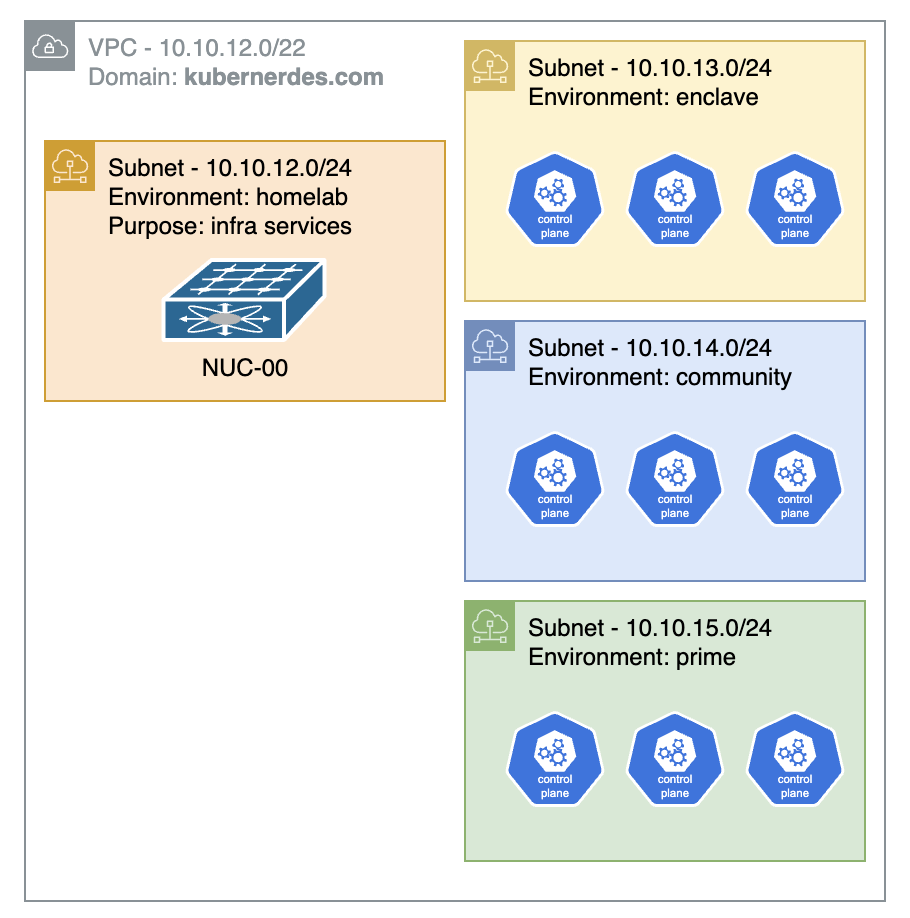

# homelab.kubernerdes.com

> [!NOTE] 
> If you were looking for content on deploying RGS bits, that has been moved to
> https://docs.carbide-enclave.kubernerdes.com/

I am rebuilding my homelab content applying some "lessons learned" from previous attempts.

The Narrative form guide for this repo is located at https://docs.homelab.kubernerdes.com/

What we are working with:
- start with vanilla installation of all the projects using "community bits"
- then shift focus to doing the same but using SUSE Prime which involves some slight modifications
- then.. using the established connection/relationship to the SUSE Prime source, we will create an "air-gapped" installation


> A single-codebase deployment framework for building a Kubernetes homelab using SUSE Rancher, Harvester, and related tooling — across Community, Prime, and Enclave environments.

This repository contains the scripts, configuration files, and documentation for deploying the full SUSE/RGS stack on small form-factor hardware (Intel NUCs). It is designed to be run against three distinct deployment environments using a shared codebase, with environment-specific behavior driven entirely by configuration.

> **Note:** This is not an official SUSE or RGS repository. It is a personal lab environment designed to explore and demonstrate the platform using straightforward, repeatable methods.

**Associated Documentation Site:** [docs.homelab.kubernerdes.com](https://cloudxabide.github.io/docs.homelab.kubernerdes.com/)

**Note:** RGS Carbide content will migrate to https://github.com/jradtke-rgs/carbide-enclave.kubernerdes.com

---

## Goals

- Single codebase that can build out a complete environment end-to-end
- Environment selection via a single config variable — no forking, no duplicating scripts
- Deploy: 
  - Harvester (SUSE Virtualization) 
  - RKE2 
  - Rancher Manager 
  - StackState (SUSE Observability)
  - NeuVector (SUSE Security) running on an RKE2 "Apps" Cluster
- Human-readable documentation that explains not just *what* to run, but *why*

---

## Environments

| Environment | Description | Subnet | Domain | Nodes |
|:-----------:|:------------|:------:|:-------|:------|
| **Homelab** | Common infrastructure utilized by any of the other Environments | 10.10.12.0/24 | homelab.kubernerdes.com | nuc-00, nuc-00-01/02/03 |
| **Enclave** | SUSE software synced via Hauler, served from a local Harbor registry (air-gapped) | 10.10.13.0/24 | enclave.kubernerdes.com | nuc-01/02/03 |
| **Community** | SUSE/upstream bits pulled from public registries | 10.10.14.0/24 | community.kubernerdes.com | nuc-01/02/03 |
| **Prime** | SUSE software pulled from the RGS registry over the internet | 10.10.15.0/24 | prime.kubernerdes.com | nuc-01/02/03 |

All three environments share the `10.10.12.0/22` supernet and have dedicated hardware — they can run simultaneously.

NUC nodes use `nuc-01/02/03` for all environments; the ENVIRONMENT variable (and DNS domain) differentiates them. Other cluster roles (rancher, observability, apps) follow a digit-prefix scheme: prime=0x, enclave=1x, community=2x (e.g. rancher-01/02/03, rancher-11/12/13, rancher-21/22/23).




**Milestones:** Prime MVP → Enclave → Community

---

## Repository Structure

```
.
├── Scripts/
│   ├── env.sh                    # Master config — sets ENVIRONMENT, sources env.d/
│   ├── env.d/
│   │   ├── community.sh          # Community-specific vars (public registry sources)
│   │   ├── prime.sh              # Prime-specific vars (SUSE registry, token)
│   │   └── enclave.sh            # Enclave-specific vars (Harbor URL, Hauler paths)
│   │
│   ├── 00_preflight.sh           # Verify prerequisites before deployment
│   ├── 02_setup_vault.sh         # Install HashiCorp Vault; initialize PKI engine as homelab root CA
│   ├── 03_distribute_ca.sh       # Push root CA to all Harvester + RKE2 nodes (retroactive)
│   ├── 07_post_configure_harvester.sh
│   ├── 10_install_rancher_manager.sh
│   ├── 20_install_security.sh
│   ├── 21_install_observability.sh
│   ├── 30_deploy_apps.sh
│   ├── 80_compare_images.sh      # Community vs Prime image comparison (NeuVector)
│   │
│   ├── install_RKE2.sh           # Install RKE2 on a cluster node; run on each node as root
│   ├── install_RKE2_postboot.sh  # Post-reboot kubeconfig setup (SL-Micro path)
│   │
│   ├── nuc-00/                   # Admin host bootstrap scripts
│   ├── nuc-00-01/                # DNS + DHCP infra VM scripts
│   ├── nuc-00-03/                # HAProxy infra VM scripts
│   │
│   └── modules/                  # Environment-specific scripts, invoked only when needed
│       ├── prime/
│       │   └── registry_auth.sh
│       └── enclave/
│           ├── hauler_sync.sh
│           └── harbor_setup.sh
│
├── Files/
│   ├── nuc-00/              # Admin host configs (Apache, KVM)
│   ├── nuc-00-01/           # Infra VM: DNS primary (BIND), DHCP (dhcpd), TFTP
│   ├── nuc-00-02/           # Infra VM: DNS secondary
│   ├── nuc-00-03/           # Infra VM: HAProxy + Keepalived
│   ├── CloudConfigurationTemplates/  # cloud-init YAML templates for VMs
│   │
│   └── overrides/           # Environment-specific file overrides (applied over common Files/)
│       ├── prime/           # e.g. Harvester registry mirror → SUSE registry
│       └── enclave/         # e.g. Harvester registry mirror → local Harbor
│       # Community has no overrides — it is the base layer
│
├── Ansible/                 # Configuration management
├── Docs/                    # Operational guides and reference
├── Images/                  # Architecture diagrams
└── Hardware.md              # Hardware inventory and IP assignments
```

---

## How Environment Switching Works

All environment differences are contained in two places:

1. **`Scripts/env.d/${ENVIRONMENT}.sh`** — variables that differ between environments (registry URLs, credentials, chart sources). The common `env.sh` sources this file automatically based on the `ENVIRONMENT` variable.

2. **`Files/overrides/${ENVIRONMENT}/`** — configuration files that need to differ from the common baseline (e.g., Harvester registry mirror config pointing to Harbor instead of Docker Hub).

The numbered scripts (`02_`, `10_`, `20_`, etc.) contain **no environment conditionals**. They read from `env.sh` and behave correctly for whichever environment is active. This keeps the main scripts readable and avoids branching logic scattered throughout the codebase.

Environment-specific *steps* (not just config values) live in `Scripts/modules/`. For example, Enclave requires a Hauler sync before deployment — that step lives in `modules/enclave/hauler_sync.sh` and is invoked explicitly, not hidden inside a common script.

### Setting the environment

```bash
export ENVIRONMENT=community   # or prime, enclave
source Scripts/env.sh
```

---

## IP Assignments

All IPs are derived from `${IP_PREFIX}` defined in `env.sh`.

| Last Octet | Hostname | Purpose |
|:----------:|:---------|:--------|
| .8 | nuc-00-01 | DNS primary (BIND + dhcpd + TFTP) |
| .9 | nuc-00-02 | DNS secondary |
| .10 | nuc-00 | Admin host (Apache + KVM + libvirt) |
| .93 | nuc-00-03 | HAProxy load balancer + Keepalived VIP |
| .100 | harvester | Harvester cluster VIP |
| .101 | nuc-X1 | Harvester node 1 (X=0 prime, 1 enclave, 2 community) |
| .102 | nuc-X2 | Harvester node 2 |
| .103 | nuc-X3 | Harvester node 3 |
| .210 | rancher | Rancher Manager cluster VIP |
| .211-.213 | rancher-X1/X2/X3 | Rancher Manager nodes |
| .220 | observability | Observability cluster VIP |
| .221-.223 | observability-X1/X2/X3 | Observability nodes |
| .230 | apps | Applications cluster VIP |
| .231-.233 | apps-X1/X2/X3 | Applications cluster nodes |

Wildcard DNS: `*.apps.${ENVIRONMENT}.kubernerdes.com` → `${IP_PREFIX}.230`

---

## Day 0 — Design and Plan

**Prerequisites**

- 3 x NUCs (or similar hardware) for Harvester nodes
- 1 x admin workstation (I use a fourth NUC as `nuc-00`)
- Internet connectivity (Community and Prime) or pre-synced Hauler store (Enclave)
- [Hardware Overview](./Hardware.md)

For Prime and Enclave: SUSE Carbide portal access — request a license from your SUSE Account Team.

---

## Day 1 — Build

1. Build the **Admin Host** (`nuc-00`)
2. Deploy **Infra VMs** (`nuc-00-01`, `nuc-00-02`, `nuc-00-03`) — DNS, DHCP, TFTP, HAProxy
3. *(Enclave only)* Run `modules/enclave/hauler_sync.sh` — sync all artifacts
4. *(Enclave only)* Run `modules/enclave/harbor_setup.sh` — stand up local registry
5. *(Prime only)* Run `modules/prime/registry_auth.sh` — configure registry credentials
6. Build the **Harvester Cluster** (`nuc-01`, `nuc-02`, `nuc-03`) via PXE or USB
7. Run `02_setup_vault.sh` — install Vault on `nuc-00`, initialize PKI engine as the homelab root CA, publish cert via Apache
8. Run `07_post_configure_harvester.sh` — cloud images, cloud-init templates, rancher-monitoring add-on
9. Run `install_RKE2.sh` on each cluster node — fetches and trusts the root CA automatically before installing RKE2

---

## Day 2 — Operate

1. Run `10_install_rancher_manager.sh` — deploy cert-manager + Rancher Manager; creates a `vault-homelab` cert-manager ClusterIssuer backed by Vault PKI
2. Run `20_install_security.sh` — deploy NeuVector on the applications cluster
3. Run `21_install_observability.sh` — deploy SUSE Observability stack
4. Run `30_deploy_apps.sh` — deploy sample workloads
5. Run `80_compare_images.sh` — compare community vs Prime images side-by-side in NeuVector

> **Retroactive CA distribution:** If you add nodes or need to push the root CA to existing nodes, run `03_distribute_ca.sh` from `nuc-00` at any time.

---

## Reference

- [Harvester Releases](https://github.com/harvester/harvester/releases)
- [Rancher Manager — Helm CLI Quick Start](https://ranchermanager.docs.rancher.com/getting-started/quick-start-guides/deploy-rancher-manager/helm-cli)
- [Hauler Documentation](https://docs.hauler.dev/docs/intro)
- [HashiCorp Vault PKI Secrets Engine](https://developer.hashicorp.com/vault/docs/secrets/pki)
- [cert-manager Vault Issuer](https://cert-manager.io/docs/configuration/vault/)
